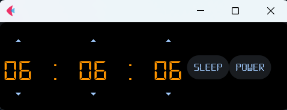

# Shut Down Timer

**Shut Down Timer** es una aplicación de temporizador desarrollada en Python con el framework **Flet**, que permite programar el apagado o la suspensión del sistema de forma sencilla y visual.

## Características
- Interfaz intuitiva y moderna.
- Ajuste fácil del tiempo del temporizador.
- Opciones para **apagar** o **suspender** el sistema al finalizar el tiempo.
- Posibilidad de **pausar** o **cancelar** el temporizador.
- Compatible por ahora con **Windows**.

## Interfaz


## Instalación
1. Clonar este repositorio:
   ```sh
   git clone https://github.com/JaiderLopez/ShutDownTimer.git
   cd shutdown-timer
   ```
2. Crear un entorno virtual (opcional pero recomendado):
   ```sh
   python -m venv venv
   venv\Scripts\activate  # Para Windows
   source venv/bin/activate  # Para Linux/Mac
   ```
3. Instalar dependencias:
   ```sh
   pip install -r requirements.txt
   ```

## Uso
Ejecuta la aplicación con:
```sh
python app.py
```

Desde la interfaz, ajusta el tiempo y selecciona si deseas **suspender** o **apagar** el sistema al finalizar el temporizador.

## Empaquetado en un ejecutable
Para generar un ejecutable en Windows, utiliza **PyInstaller** con el siguiente comando:
```sh
pyinstaller --onefile --add-data "assets;assets" --windowed .\app.py
```
Este comando:
- Crea un ejecutable **.exe** en la carpeta `dist`.
- Incluye la carpeta **assets** en el ejecutable para poder utilizar la fuente y otros recursos.
- Ejecuta la aplicación sin mostrar la consola (modo `--windowed`).

## Licencia
Este proyecto está bajo la licencia **MIT**.

---
Hecho con ❤️ en Python y Flet.

